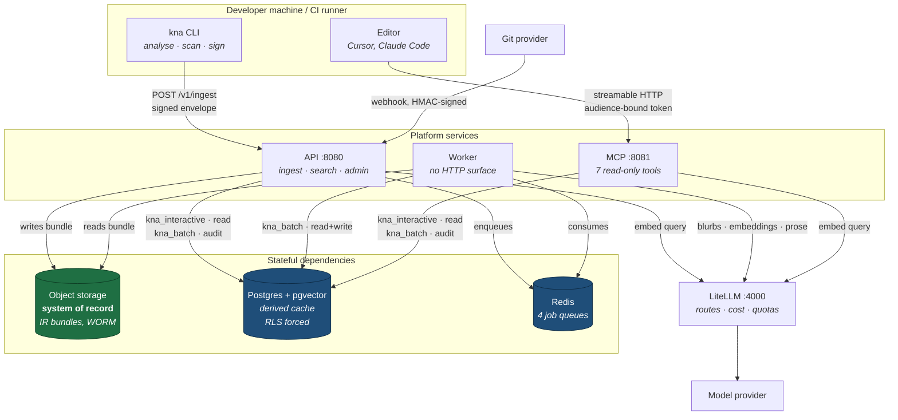
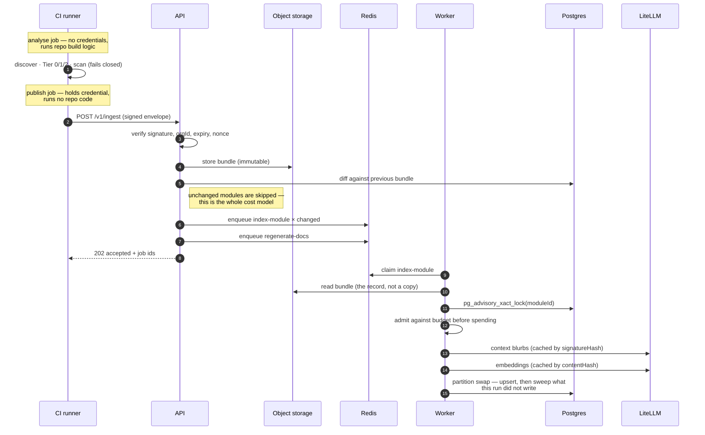
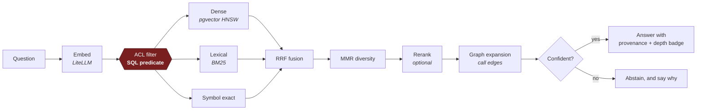
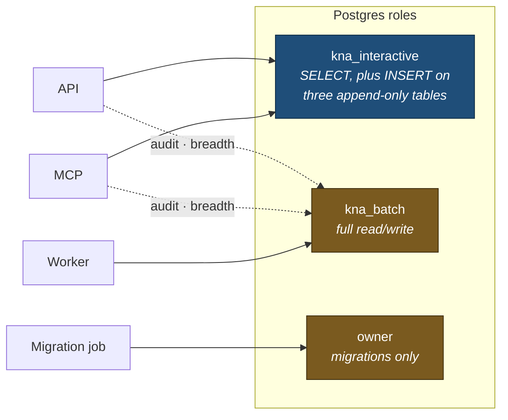

# Architecture

> **Authorship.** Written by an LLM (Claude Opus 5), not by a human. It describes code
> written in the same session, so it agrees with that code by construction. The "where the
> design was extended" table is the exception — each row there was found by something
> failing. See [Authorship and evidence](AUTHORSHIP.md).

How the pieces fit, and which finding shaped each. This is the map; the design document
(`architecture-recommendation.md`) is the reasoning, and the code carries the citations.

---

## The shape

```
DEVELOPER MACHINE / CI
  docs-cli
    discovery ─→ Tier 0 (always) ─→ Tier 1 (if toolchain) ─→ Tier 2 (build artifacts)
                                          │
                                    guardrail scan  ← fails closed, before anything leaves
                                          │
                                    IR assembly  ← identity minted exactly once
                                          │
                                    sign + publish
                                          │
────────────────────────────────────────┼─────────────────────────────────────────────────
                                          ▼  HTTPS, signed, repo-scoped credential
PLATFORM
  ingest ─→ verify ─→ store bundle ─→ diff ─→ circuit breaker ─→ fan out per module
                          │                                            │
              object storage (system of record)              BullMQ + advisory locks
                                                                       │
                                          chunk → blurb → embed → partition swap → sweep
                                                                       │
  ┌────────────────────────── Postgres + pgvector ─────────────────────┘
  │
  ├─→ retrieval: dense + lexical + symbol → RRF → diversity → rerank → expand → abstain
  │        │
  │        ├─→ API  (/v1/search)
  │        ├─→ web  (/chat, /admin — React, served by the API)
  │        └─→ MCP  (seven read-only tools)
  │
  └─→ docgen: deterministic render + bounded prose → reviewed pull request
```

---

## System view

Every arrow is a real call in the code. Credentials are named because which one a service holds
is a design decision, not a detail.



The green box is the one that matters. Object storage holds the IR bundles and **is the system of
record**; Postgres is an explicitly derived cache that can be dropped and rebuilt by replaying
them. That inversion is what makes reindexing cheap, staging realistic, and disaster recovery a
rehearsable procedure rather than a hope.

---

## Ingest: how code becomes knowledge

The trust boundary is the vertical line. Everything left of the API runs on a machine you do not
control; only a signed, scanned bundle crosses.



Two properties are load-bearing and easy to destroy by simplification:

- **The analyse and publish jobs are separate.** Analysis executes the repository's own build
  logic, so a publish credential on that runner is remote code execution by design. The bundle is
  what crosses between them.
- **The sweep compares ids, not commit shas.** Deleting "anything not from this commit" is right
  for a new commit and silently wrong for a deliberate reindex or a retried crash, which stamp
  the same one.

---

## Query: how a question becomes an answer



The red node is the security boundary. The ACL filter is a **predicate inside the query**, applied
before scoring — never a post-filter and never a prompt instruction. Filtering after ranking still
leaks result counts and relative scores for repositories the caller cannot read. Row-level
security enforces the same thing a second time underneath, in case the filter has a bug.

Every result carries an `analysisDepth` badge from the analyser that produced it, all the way
into the response, so shallow output is never presented with the confidence of semantic output.

---

## Who talks to what, and with which credential



The internet-facing services connect as a role that cannot modify tenant data. They hold a second
handle only for writes the platform owes regardless of the caller — the audit trail and breadth
accounting — because granting the request path UPDATE on, say, the credential table would be a
write primitive exactly where it is least wanted.

Migrations run as the owner in a separate image. If a service ever connected as the owner,
row-level security would become **silently** inert, so every service asserts
`kna_rls_is_effective()` at startup and refuses to serve otherwise.

---

## Queues

Four, consumed by one worker process with different concurrency because the jobs have different
shapes.

| Queue | Concurrency | Job identity | Why |
|---|---|---|---|
| `index-module` | 4 | `(moduleId, commitSha)` | Provider-bound; parallelism helps |
| `regenerate-docs` | 1 | `(repoId, commitSha)` | One model call per module, in sequence |
| `cross-repo-resolve` | 1 | `(projectId)` | Takes a per-project lock; parallelism only contends |
| `maintenance` | 1 | `(orgId)` | Nightly reconciliation and invariant checks |

Job identity gives replayed-webhook idempotency for free — a duplicate id is refused at the queue
rather than detected in the worker. It also means a deliberate re-run is a silent no-op, which is
why explicit triggers pass a discriminator that joins the id.

Per-module serialisation is a **Postgres advisory lock**, not a queue feature, because stock
BullMQ cannot enforce per-key concurrency. A re-dispatched stalled job blocks on the lock instead
of interleaving with the run that is still going.

---

## Package dependency order

Nothing above depends on anything below it, which is what keeps the IR usable independently of
the platform.

```
ir                              no dependencies beyond zod — deliberately
  ├── config, contracts, scanner
  ├── analyzer-core ── analyzer-typescript, analyzer-openapi
  ├── db, llm
  │     └── chunking ── retrieval ── docgen
  └── observability
```

`@kna/ir` is importable on its own. §4.2's claim — that the IR is the whole system — only holds
if consuming it does not drag in a database driver.

---

## The five decisions everything else follows from

### 1. The IR is the contract, not an implementation detail

§4.2. Language-specific analysers produce it; everything downstream is language-agnostic.

The consequence people underestimate: **drift detection becomes a structural diff.** `diffIr()`
compares `signatureHash` and classifies. A typical merge changes bodies rather than signatures,
so it triggers a handful of embedding upserts and zero LLM calls. That is the difference between
cents per merge and a system nobody can afford to leave switched on.

`normalizeSignature()` is what makes it hold. A Prettier upgrade must not flip every hash, and
the test suite asserts invariance under reformatting, trailing commas and comment changes —
while asserting that a parameter type change *does* flip it.

### 2. Deterministic-first, LLM-second

§6. `packages/docgen/src/render.ts` calls no model. `prose.ts` calls one, sees only IR facts, and
its output is checked against those facts by a separate judge before publication. Ungrounded
prose is **dropped**, not published with a caveat.

A page with accurate tables and no narrative is a good document. A page with one invented
sentence is a liability, and §16 gives it a price: two bad answers loses a team permanently.

### 3. Module is the unit of everything

§4.3 makes module the unit of project membership; §15.1 fix 3 extends it to atomicity and
concurrency.

So: chunks are partitioned by module, the reindex is a partition swap inside one transaction,
and serialisation is a Postgres advisory lock keyed on `moduleId`. That last point is a decision
§15.6 forces — stock BullMQ cannot enforce per-key concurrency, and a stalled-job re-dispatch
would otherwise interleave with the original run. BullMQ schedules; Postgres serialises.

### 4. Hybrid retrieval, with the reviews' additions in the same flow

§8's pipeline, plus what §15.5 adds — placed inline rather than bolted alongside:

```
query → rewrite (multi-turn) → dense ‖ lexical ‖ symbol → RRF
      → diversity (MMR + per-module cap)   ← before reranking, not after
      → cross-encoder rerank
      → budget primary → expand within what remains
      → abstention gate                    ← before anything reaches a model
      → trace
```

Two placements are load-bearing. **Diversity before reranking**, because otherwise the reranker
faithfully ranks eight copies of the same answer. **Abstention before generation**, because weak
retrieval flowing into a model identically to strong retrieval is precisely how the
confident-and-wrong answer gets produced.

### 5. Guardrails are a precondition, not a phase

§10. Six layers, built in Phase 1, because an embedded secret cannot be retracted — it has
already reached the vector index, the caches, and possibly a provider's logs.

See [SECURITY.md](SECURITY.md) for what each layer actually enforces.

---

## Where the design was extended

Not departures — the reviews in §15 anticipated most of these. Recording them because the
implementation makes choices the prose left open.

| Extension | Why |
|---|---|
| **`filesAnalyzed` in the analyser contract** | Superseding Tier 0 by symbol identity does not work: the two tiers never agree on an overload discriminator, so every symbol emitted twice. Discovered by the pipeline test, which showed a module claiming `shallow` despite semantic analysis succeeding |
| **`assertRlsEffective()` at startup** | A superuser bypasses RLS *silently*. Found by the integration test: policies existed, the invariant check passed, and every tenant read every other tenant. RLS that is enabled and inert is worse than none, because it is believed |
| **`halfvec` rather than `vector`** | §11's dimension trap, resolved structurally. Indexes to 4,000 dimensions, so both escape hatches stay open without a schema change |
| **Migration 0004** | The invariant check found `lexical_stats` unprotected — created after the policy loop in the same migration. Fixed forward, because applied migrations are immutable |
| **Post-generation DDL fixup** | Drizzle emits `"halfvec(1536)"` quoted, which Postgres reads as a type of that literal name. Automated rather than hand-edited, because hand-editing works until the once it is forgotten |
| **Symbol id algorithm v2** | §15.1 flags `sha256(repo + module + qualifiedName)` as not rename-stable. v2 keys on package identity where one exists, so a directory move is a no-op for identity |

---

## What is not built

Recorded so the gaps are explicit rather than discovered.

| Not built | Why |
|---|---|
| Python (Griffe) and .NET (Roslyn) analysers | Contract, transport, conformance suite and registry are complete. §5 estimates a week each against the suite |
| Git provider calls | Interfaces, refusal logic and write-gating are complete; the provider HTTP calls are not. `WriteDisabledError` fires correctly, which is the part that matters |
| Sigstore bundle verification | Claim-matching against asserted scope is implemented — the part §15.2 is actually about. The cryptographic bundle verification delegates to `@sigstore/verify` |
| Web UI, docs site | Bought, not built. ADR 0001 |
| External Documentation Assistant | Deferred. §15.8 makes it a product launch with an SLA and staffed hours, not a feature |

---

## Reading order

For someone new to the codebase, in the order that makes each next file make sense:

1. `packages/ir/src/schema/symbol.ts` — the contract everything reads
2. `packages/ir/src/diff/diff.ts` — why synchronisation is cheap
3. `packages/analyzer-typescript/src/analyzer.ts` — what an analyser actually does
4. `packages/retrieval/src/pipeline.ts` — the whole retrieval flow in one file
5. `packages/retrieval/src/acl.ts` — the security boundary, in SQL
6. `apps/worker/src/jobs/index-module.ts` — the partition swap and the stale-chunk sweep
7. `apps/api/src/routes/ingest.ts` — the trust boundary

§18's advice applies to reading as much as to building: *"If the IR is right, everything else is
conventional engineering."*
