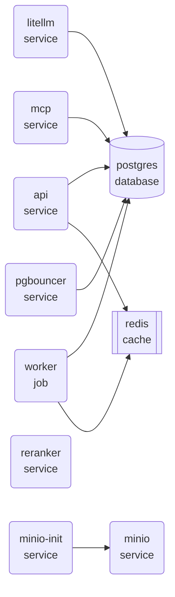
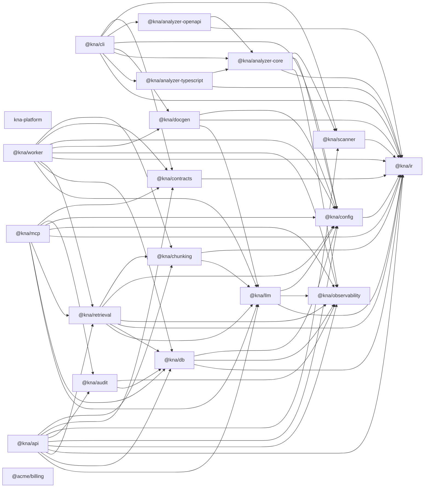

# kna architecture

<!-- kna:generated:start id=architecture.summary hash=90dd005ce4b8f260 -->
| | |
|---|---|
| Repository | `github.com/nmsanka/kna` |
| Revision | `master` |
| Modules | 20 |
| Internal dependencies | 65 |
| Runtime services | 10 |
| HTTP endpoints | 3 |
| Languages | typescript, python |
<!-- kna:generated:end id=architecture.summary -->

<!-- kna:generated:start id=architecture.context hash=63ad7c0463de2068 -->

Text description of the diagram above

Runtime topology: 10 service(s)

- api (service) depends on postgres, redis
- litellm (service) depends on postgres
- mcp (service) depends on postgres
- minio (service) depends on nothing in this repository
- minio-init (service) depends on minio
- pgbouncer (service) depends on postgres
- postgres (database) depends on nothing in this repository
- redis (cache) depends on nothing in this repository
- reranker (service) depends on nothing in this repository
- worker (job) depends on postgres, redis

| Service | Kind | Image | Declared in |
|---|---|---|---|
| `api` | service | — | `deploy/docker-compose.yml` |
| `litellm` | service | `ghcr.io/berriai/litellm:main-stable` | `deploy/docker-compose.yml` |
| `mcp` | service | — | `deploy/docker-compose.yml` |
| `minio` | service | `minio/minio:latest` | `deploy/docker-compose.yml` |
| `minio-init` | service | `minio/mc:latest` | `deploy/docker-compose.yml` |
| `pgbouncer` | service | `edoburu/pgbouncer:latest` | `deploy/docker-compose.yml` |
| `postgres` | database | `pgvector/pgvector:pg17` | `deploy/docker-compose.yml` |
| `redis` | cache | `redis:7-alpine` | `deploy/docker-compose.yml` |
| `reranker` | service | `ghcr.io/huggingface/text-embeddings-inference:cpu-1.6` | `deploy/docker-compose.yml` |
| `worker` | job | — | `deploy/docker-compose.yml` |
<!-- kna:generated:end id=architecture.context -->

<!-- kna:generated:start id=architecture.container hash=e6d7b46e1a9052d9 -->

Text description of the diagram above

Module graph: 20 module(s), 65 internal dependency edge(s). Solid arrows are runtime dependencies; dashed arrows are development-only.

- @kna/worker depends on @kna/chunking
- @kna/worker depends on @kna/contracts
- @kna/worker depends on @kna/config
- @kna/worker depends on @kna/docgen
- @kna/worker depends on @kna/observability
- @kna/worker depends on @kna/ir
- @kna/worker depends on @kna/retrieval
- @kna/worker depends on @kna/db
- @kna/worker depends on @kna/llm
- @kna/chunking depends on @kna/ir
- @kna/chunking depends on @kna/llm
- @kna/contracts depends on @kna/ir
- @kna/scanner depends on @kna/ir
- @kna/analyzer-openapi depends on @kna/analyzer-core
- @kna/analyzer-openapi depends on @kna/ir
- @kna/cli depends on @kna/contracts
- @kna/cli depends on @kna/scanner
- @kna/cli depends on @kna/analyzer-openapi
- @kna/cli depends on @kna/config
- @kna/cli depends on @kna/docgen
- @kna/cli depends on @kna/analyzer-core
- @kna/cli depends on @kna/analyzer-typescript
- @kna/cli depends on @kna/ir
- @kna/audit depends on @kna/observability
- @kna/audit depends on @kna/db
- @kna/config depends on @kna/ir
- @kna/docgen depends on @kna/config
- @kna/docgen depends on @kna/ir
- @kna/docgen depends on @kna/llm
- @kna/analyzer-core depends on @kna/scanner
- @kna/analyzer-core depends on @kna/config
- @kna/analyzer-core depends on @kna/observability
- @kna/analyzer-core depends on @kna/ir
- @kna/mcp depends on @kna/contracts
- @kna/mcp depends on @kna/audit
- @kna/mcp depends on @kna/config
- @kna/mcp depends on @kna/observability
- @kna/mcp depends on @kna/ir
- @kna/mcp depends on @kna/retrieval
- @kna/mcp depends on @kna/db
- @kna/mcp depends on @kna/llm
- @kna/api depends on @kna/chunking
- @kna/api depends on @kna/contracts
- @kna/api depends on @kna/scanner
- @kna/api depends on @kna/audit
- @kna/api depends on @kna/config
- @kna/api depends on @kna/observability
- @kna/api depends on @kna/ir
- @kna/api depends on @kna/retrieval
- @kna/api depends on @kna/db
- @kna/api depends on @kna/llm
- @kna/analyzer-typescript depends on @kna/analyzer-core
- @kna/analyzer-typescript depends on @kna/ir
- @kna/retrieval depends on @kna/chunking
- @kna/retrieval depends on @kna/config
- @kna/retrieval depends on @kna/observability
- @kna/retrieval depends on @kna/ir
- @kna/retrieval depends on @kna/db
- @kna/retrieval depends on @kna/llm
- @kna/db depends on @kna/config
- @kna/db depends on @kna/observability
- @kna/db depends on @kna/ir
- @kna/llm depends on @kna/config
- @kna/llm depends on @kna/observability
- @kna/llm depends on @kna/ir

<!-- kna:generated:end id=architecture.container -->

<!-- kna:generated:start id=architecture.component hash=0478d67c743a8505 -->
| Module | Depended on by | Public symbols | Endpoints | Languages | Owners |
|---|---:|---:|---:|---|---|
| `packages/ir` | 15 | 180 | 0 | typescript | — |
| `packages/config` | 9 | 31 | 0 | typescript | — |
| `packages/observability` | 8 | 37 | 0 | typescript | — |
| `packages/llm` | 6 | 98 | 0 | typescript | — |
| `packages/db` | 5 | 79 | 0 | typescript | — |
| `packages/contracts` | 4 | 70 | 0 | typescript | — |
| `packages/retrieval` | 3 | 328 | 0 | typescript | — |
| `packages/analyzer-core` | 3 | 124 | 0 | typescript | — |
| `packages/scanner` | 3 | 87 | 0 | typescript | — |
| `packages/chunking` | 3 | 71 | 0 | typescript | — |
| `packages/docgen` | 2 | 143 | 0 | typescript | — |
| `packages/audit` | 2 | 34 | 0 | typescript | — |
| `packages/analyzer-openapi` | 1 | 38 | 0 | typescript | — |
| `packages/analyzer-typescript` | 1 | 28 | 0 | typescript | — |
| `apps/api` | 0 | 219 | 1 | typescript | — |
| `apps/worker` | 0 | 95 | 1 | typescript | — |
| `apps/cli` | 0 | 93 | 0 | typescript | — |
| `apps/mcp` | 0 | 63 | 1 | typescript | — |
| `packages/analyzer-typescript/test/fixtures/billing` | 0 | 33 | 0 | typescript | — |
| `.` | 0 | 19 | 0 | typescript, python | — |

Ordered by in-degree. `packages/ir` is the most depended-upon module here, which makes it the one where a breaking change costs most.
<!-- kna:generated:end id=architecture.component -->

<!-- kna:generated:start id=architecture.confidence hash=fee125b5aad123bd -->
**1 of 20 module(s) were analysed at shallow depth.** Their
dependency edges come from declared manifests only; type references and call edges that
would appear at semantic depth are missing from the diagrams above.

| Module | Why |
|---|---|
| `.` | No analyser registered for python |

CI runners that build this repository have those toolchains by definition, so the
shared index is more complete than a local run. `kna doctor` explains a specific case.
<!-- kna:generated:end id=architecture.confidence -->

<!-- kna:generated:start id=architecture.api-surface hash=2da356d23a8c0c71 -->
| Method | Route | Module | Auth | Handler |
|---|---|---|---|---|
| `GET` | `/health` | `apps/api` | _none declared_ | `ApiContext.health` |
| `GET` | `/health` | `apps/mcp` | _none declared_ | `McpContext.health` |
| `GET` | `/health` | `apps/worker` | _none declared_ | `WorkerContext.health` |

> 3 endpoint(s) declare no authentication in their specification. That may be correct — health checks and public documentation routes usually are — but it is worth confirming rather than assuming the specification is incomplete.
<!-- kna:generated:end id=architecture.api-surface -->
